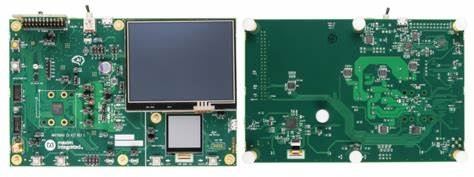
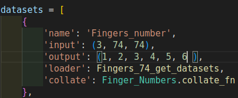

# The MAX78000 hand gesture control
The main reference to the official warehouse of the board for training and deploying neural networks:`Github`

## Project Introduction
To control TV with hands or fingers, we want to create AI. to make  smart TV more convenient to use,This project will use MAX78000EVkit for deployment and test AI hand gesture control.
## MAX78000EVkit


**You can purchase and read more details here: https://www.analog.com/en/products/max78000.html**

The MAX78000 evaluation kit (EV kit) provides a platform for leveraging the capabilities of the MAX78000 to build new generations of artificial intelligence (AI) devices.

Onboard hardware includes a digital microphone, a gyroscope/ accelerometer, parallel camera module support and a 3.5in touch-enabled color TFT display. A secondary dis- play is driven by a power accumulator for tracking device power consumption over time. Uncommitted GPIO as well as analog inputs are readily accessible through 0.1in pin headers. Primary system power as well as UART access is provided by a USB Micro-B connector. A USB to SPI bridge provides rapid access to onboard memory, allow- ing large networks or images to load quickly.

https://www.analog.com/en/design-center/evaluation-hardware-and-software/evaluation-boards-kits/max78000evkit.html#eb-overview

### Purpose
This project create for use hand or fingers to control TV instead remote.

### Project design ideas
There are four main components of this project, as shown in the figure below:
- MAX78000EVKIT For Tinierssd model.
- Arduino nano (Used to transmitter infrared signals to control Smart TV.)
- LED Infrared.
- Schottky Diode Bi-Directional Logic Level Conversion Circuit
  - 10k Resistor 
  - 1N4148 Diode 
Block Diagram


Schottky Diode Bi-Directional Logic Level Conversion Circuit


## Installation
Click this link for installation: https://github.com/MaximIntegratedAI/ai8x-training#installation

### Project process
The software part trains the neural network on the computer and deploys it to run on a single-chip microcomputer, using the CNN neural network accelerator built into the chip.

The main reference to the official warehouse of the board for training and deploying neural networks:`Github`

* `ai8x-training` Repository for training neural networks on computers:

https://github.com/MaximIntegratedAI/ai8x-training

* `ai8x-synthesis` Repository, used to convert the trained model file into C code:

https://github.com/MaximIntegratedAI/ai8x-synthesis

* `msdk` Warehouse, for writing microcontroller programs:

https://github.com/Analog-Devices-MSDK/msdk

* You can download our file for compare your result! : [Project_file.zip 1](https://github.com/WeerawatW/MAX78000-hand_gesture_control/releases/download/untagged-942b36396836df061b0d/project_file.zip) or [Project_file.zip 2](https://github.com/WeerawatW/MAX78000-hand_gesture_control/releases/download/ProjectFile/project_file.zip)

* But you can dowload file step by step too!.
## 1) ai8x-training
Process datasets 
You can download only [datasets.zip](https://github.com/WeerawatW/MAX78000-hand_gesture_control/releases/download/ProjectFile/Dataset.zip) here.


After the download is complete, I organize the directory according to the following structure:
>
```
ai8x-training
 └─ data
   └─ Finger_Numbers
             ├─ processed
             │    ├─ test_info.csv
             │    ├─ train_info.csv
             │
             ├─ test
             └─ train
```
Place `finger_number.py` in dataset folder.
```
ai8x-training
  └─ dataset
        └─ finger_number.py  
```
Dowload file here: [finger_number.py](https://github.com/WeerawatW/MAX78000-hand_gesture_control/blob/6c95af2d96c45ef934c73e30a5c9bdb86bf1a01e/ai8x-training/datasets/finger_number.py)
second link [finger_number.py](https://github.com/WeerawatW/MAX78000-hand_gesture_control/blob/main/github%20python%20file/finger_number.py)

We config `finger_number.py` output parameter must match any class we have, in this case we have 6 class.



> [how to prepare dataset? ](https://github.com/WeerawatW/MAX78000-prepare-dataset.git)

The fields have the following meanings:
*  `name`: The dataset name, the name passed in when training the neural network
*  `input`: The size of the neural network input, indicates: the width of the input picture is 74, the height is 74, and 3 represents the three channels of RGB(3, 74, 74)
*  `output`: The neural network outputs classification results , in this project we need to identify 6 classes fingers,and there is 6 output class here.
*  `loader`: A function that loads a dataset and needs to return a tuple. Each dataset has to be implemented and magical. Returns the size of the dataset. Returns a training sample in the format of a tuple. For neural networks with images as input, a three-dimensional array representing the input images. For the object detection task, tuples, composed of all callout boxes, each labeled box is, where coordinates are normalized. 
* `collate_fn`: Since each image may have a different number of objects, we need a collate function
        (to be passed to the DataLoader).
        This describes how to combine these tensors of different sizes. We use lists.
        :param batch: an iterable of N sets from __getitem__()
        :return: a tensor of images, lists of varying-size tensors of bounding boxes and labels
  
  `finger_number.py` output must match [ship label](https://github.com/WeerawatW/MAX78000-prepare-dataset/tree/main#ship-label) 

Place `train_Fingers_Numbers.sh` in ai8x-training.

```
ai8x-training
  └─ train_Fingers_Numbers.sh
```
Dowload [train_Fingers_Numbers.sh](https://github.com/WeerawatW/MAX78000-hand_gesture_control/blob/2fb763b1f79c7f50ea98afd5a034290114651a4b/ai8x-training/train_Fingers_Numbers.sh) here.

In `train_Fingers_Numbers.sh` :
```
python train.py --deterministic --print-freq 200  --epochs 100 --optimizer Adam --lr 0.001 --wd 0 --model ai85tinierssd --use-bias --momentum 0.9 --weight-decay 5e-4 --dataset Fingers_number --device MAX78000 --obj-detection --obj-detection-params parameters/obj_detection_params_svhn.yaml --batch-size 16 --qat-policy policies/qat_policy_svhn.yaml --validation-split 0 "$@"
```

The meaning of each parameter is as follows:
| Parameters | value | describe parameter |
| ------------ |----| ------------------- |
| deterministic |none value| Set the random number seed to produce repeatable training results |
| print-freq | 200 | In each epech, how many training samples are printed once |
| pr-curves |none value| Display the precision-recall curves Display the precision-recall curve |
| epochs | 100 | the number of training times |
| optimizer | Adam | optimizer |
| lr | 0.001 | learning rate learning rate |
| wd | 0 | weight decay |
| model | ai85tinierssd | model selection, the model definition is in the models folder |
| use-bias | none value | use bias |
| momentum | 0.9 | Momentum, a parameter of the Adam optimizer |
| weight-decay | 5e-4 | Weight decay to prevent overfitting |
| dataset | Fingers_number | dataset name, previously defined in the dataset loading file |
| device | MAX78000 | MCU chip model |
| obj-detection | none value | object detection |
| obj-detection-params | none value | parameters/obj_detection_params_svhn.yaml target recognition training parameters |
| batch-size | 16 | The number of samples passed into the neural network each time |
| qat-policy policies/qat_policy_svhn.yaml| none value| policy for quantization parameters |
| validation-split | 0 | Portion of training dataset to set aside for validation We have an independent validation set, no need to divide from the training set, here is set to 0 |

Open terminal and type this command:
```
$cd ai8x-training
$source venv/bin/activate
$./train_Fingers_Numbers.sh
```
The trained model will be saved in a directory with these files:`logs`
```
 2023.06.07-141418.log
 best.pth.tar
 checkpoint.pth.tar
 qat_best.pth.tar
 qat_checkpoint.pth.tar
```
The naxt step in this will be used `qat_best.pth.tar` but before use we must rename `qat_best.pth.tar` to `ai85-finger-numbers-qat8.pth.tar`.

## 2) ai8x-synthesis
Place `ai85-finger-numbers-qat8.pth.tar` in directory according to the following structure.
```
ai8x-synthesis
   └─ trained
        └─ ai85-finger-numbers-qat8.pth.tar
```
You will get `ai85-finger-numbers-qat8-q.pth.tar` after run script `quantize_Finger_Numbers.sh`
 by using `ai85-finger-numbers-qat8-q.pth.tar`  for generate c code.

Dowload [sample_fingers_number.npy](https://github.com/WeerawatW/MAX78000-hand_gesture_control/blob/main/ai8x-synthesis/tests/sample_fingers_number.npy) here.
Place `sample_fingers_number.npy` in directory according to the following structure.

```
ai8x-synthesis
   └─ tests
       └─ sample_fingers_number.npy
```
 **sample_fingers_number.npy** is a fake data(random numpy array) use to test your model. 

Dowload [finger_numbers.yaml](//github.com/WeerawatW/MAX78000-hand_gesture_control/blob/main/ai8x-synthesis/network/finger_numbers.yaml) here.
Place `finger_numbers.yaml` in directory according to the following structure.

```
ai8x-synthesis
   └─ network
       └─ finger_numbers.yaml
```
I configuration `layer 16 to layer 19 output_processors 0xffffffff00000000` that depend on `finger_number.py`  output.
| number of classes | output_processors | how many bit of output_processors|
| -------- | ---------------- | -------------------------------- |
| 1 or 2 | 0xff00000000000000 |              8 bit               |
| 3 or 4 | 0xffff000000000000 |             16 bit               |
| 5 or 6 | 0xffffff0000000000 |             24 bit               |
| 7 or 8 | 0xffffffff00000000 |             32 bit               |
| 9 or 10 | 0xfffffffffff00000 |            44 bit               |

Place `quantize_Finger_Numbers.sh` and `gen-finger_numbers.sh` in directory according to the following structure.

```
ai8x-synthesis
   ├─ quantize_Finger_Numbers.sh
   └─ gen-finger_numbers.sh
```

Dowload [quantize_Finger_Numbers.sh](https://github.com/WeerawatW/MAX78000-hand_gesture_control/blob/main/ai8x-synthesis/quantize_Finger_Numbers.sh) here.

In `quantize_Finger_Numbers.sh` :
```
python quantize.py trained/ai85-finger-numbers-qat8.pth.tar trained/ai85-finger-numbers-qat8-q.pth.tar --device MAX78000 -v "$@"
```
This step will convert ai85-finger-numbers-qat8.pth.tar to  ***ai85-finger-numbers-qat8-q.pth.tar*** , that use in `gen-finger_numbers.sh`.

Dowload [gen-finger_numbers.sh](https://github.com/WeerawatW/MAX78000-hand_gesture_control/blob/main/ai8x-synthesis/gen-finger_numbers.sh) here.

In `gen-finger_numbers.sh` :
```
python ai8xize.py --test-dir sdk/Examples/MAX78000/CNN --prefix finger_numbers --checkpoint-file trained/ai85-finger-numbers-qat8-q.pth.tar --config-file networks/finger_numbers.yaml --device MAX78000 --compact-data --mexpress --timer 0 --display-checkpoint --verbose --overlap-data --mlator --new-kernel-loader --overwrite --no-unload
```

The meaning of each parameter is as follows:
| parameters | discript parameter |
| ----------- | ----------------- |
| test-dir sdk/Examples/MAX78000/CNN | save directory |
| prefix finger_numbers | saved folder name |
| checkpoint-file trained/ai85-finger-numbers-qat8-q.pth.tar | quantization format file |
| networks/finger_numbers.yaml | network configuration file |
| device MAX78000 | the chip model of the microcontroller |
| compact-data | Use memcpy() to load input data to save code space (also enabled by default) |
| mexpress | use express kernel loading (also enabled by default) |
| timer 0 | use timer to time the inference (default: off, supply timer number) Whether to use timer to record the running time of CNN |
| display-checkpoint | show parsed checkpoint data |
| verbose | verbose output |
| overlap-data | allow output to override input |
| mlator | Use hardware to swap output bytes |
| new-kernel-loader | (also enabled by default) |
| overwrite | overwrite target (if present) |
| no-unload | disable cnn_unload() function |

Type the following command:
```
$deactivate
$cd 
$cd ai8x-synthesis
$source venv/bin/activate
$./quantize_Finger_Numbers.sh
$./gen-finger_numbers.sh
```
After the run is completed, you will get the generated file in the directory `sdk/Examples/MAX78000/CNN/finger_numbers`


## 3) Deployment on board MAX78000EVkit

Configure the environment
The environment here is very well configured, for the system, you do not need to clone the code from above, you can directly use the official exe program to install: https://www.analog.com/en/design-center/evaluation-hardware-and-software/software/software-download.html?swpart=sfw0010820a

After the installation is completed, it is necessary to configure a little, and then you can use it to complete compilation, burning and other operations.

### Getting Started with Visual Studio Code

The MSDK includes Visual Studio Code ("VS Code") support through the [VSCode-Maxim](https://github.com/Analog-Devices-MSDK/VSCode-Maxim) project.

This section walks through setup, opening, and running an example project with VS Code. This material is also available in video form targeting the MAX78000 in ["Understanding Artificial Intelligence Episode 8.5 - Visual Studio Code"](https://www.analog.com/en/education/education-library/videos/6313212752112.html). For complete documentation, see the[ Visual Studio Code](https://analog-devices-msdk.github.io/msdk/USERGUIDE/#visual-studio-code) section of this User Guide.

### Setup (VS Code)

The setup below only needs to be done once per MSDK https://analog-devices-msdk.github.io/msdk/USERGUIDE/#installation

1. Download and install Visual Studio Code for your OS here. https://code.visualstudio.com/Download
2. Launch Visual Studio Code.
3. Install the Microsoft https://marketplace.visualstudio.com/items?itemName=ms-vscode.cpptools
4. Use CTRL + SHIFT + P (or COMMAND + SHIFT + P on MacOS) to open the developer prompt.
5. Type "open user settings" and select the "Preferences: Open User Settings (JSON)" option.


6. Add the entries below to your user settings.json file. Change the MAXIM_PATH option to point to the MSDK installation.


For example, you might set "MAXIM_PATH":"C:/MaximSDK" on Windows, "MAXIM_PATH":"/home/username/MaximSDK" on Linux/MacOS, etc.

7. Save your changes to the file with CTRL + S and restart VS Code.

### Building and Running a Project (VS Code)

1. Launch Visual Studio Code.
2. Select File -> Open Folder...

 

3. Navigate to an example project for the target microcontroller in the Myproject folder and open it with Select Folder.


4. VS Code will prompt for trust the first time. Select Trust folder and enable all features.


5. The opened project should look something like this.


6. Set the Board Support Package to match your evaluation platform. In VS Code, this is done by editing the .vscode/settings.json file and setting the "board" project configuration option.

See https://analog-devices-msdk.github.io/msdk/USERGUIDE/#board-support-packages for more details.


7. Save your changes to settings.json with CTRL+S.
8. Reload the VS Code window. After changing any options in settings.json, a reload is necessary to force it to re-index VS Code's Intellisense engine.
   VS Code can be conveniently reloaded with the Reload Window developer command accessed with CTRL + SHIFT + P (or COMMAND + SHIFT + P on MacOS).
   


9. Press the shortcut Ctrl+Shift+B to open the available Build Tasks (alternatively navigate to Terminal -> Run Build task...).


10. Run the "build" task to compile the project for the configured Target Microcontroller and BSP. Notice that the TARGET and BOARD Build Configuration Variables are set on the command line. The program binary is successfully compiled into the .elf program binary in the build sub-folder of the project.


11. Connect a debug adapter between the host PC and the evaluation platform. Detailed instructions on this hardware setup can be found in the evaluation platform's Datasheet and Quick-Start Guide, which are available on its https://www.analog.com/en/index.html product page.
12. Run the flash build task. Running this task will automatically build the project if needed, flash the program binary, and halt the program execution to await a debugger connection.


13. Open the Run and Debug window (CTRL+SHIFT+D) and launch the debugger (F5).


14. Verify the program counter enters main successfully.


     
15. Press Continue (F5) to run the program.


16. Exercise the debugger and press stop to disconnect when finished.

### How to use.


## MAX78000EVKIT Design Processing
  The UART send code is as follows:


## Arduino Nano Design Logic
  when MAX78000EVKIT send Data to Arduino Nano 

  
  
  


## Conclusion
----------------------------------------------
---------------------------------------------
